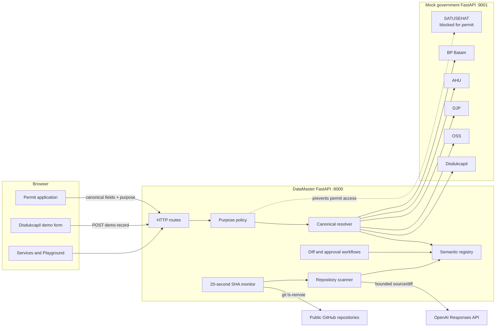

# DataMaster

## 🚀 Quick Links
* **Batam Singapore Hackathon 2026:** [LinkedIn Post](https://www.linkedin.com/posts/batam-innovation-center_winners-announcement-for-hackathon-rising-activity-7495125305234305025-yhUr)
* **Product Demonstration:** [YouTube Video Demo](https://youtu.be/NAUMH0jjMEk)
* **Presentation Slides:** [Google Slides Pitch Deck](https://docs.google.com/presentation/d/1XZIQMvin1kSpVvLUVq1FC_ckJuXYatya/edit?usp=sharing&ouid=106817690326624613910)


**An AI-assisted government integration control layer for Batam.**

DataMaster gives downstream government services one stable, canonical API while
the underlying data remains owned by the agency that masters it. The prototype
demonstrates a BP Batam permit application that retrieves verified identity,
tax, business-registration, and legal-entity data from several agency APIs
instead of asking an applicant to enter the same information again.

It also demonstrates how DataMaster can inspect a public GitHub repository,
generate grounded API documentation, monitor its commit SHA every 20 seconds,
and refresh the Services catalog when the repository changes.

> OpenAPI describes one API. DataMaster manages how multiple APIs are
> discovered, documented, called, governed, and changed without breaking their
> consumers.

This repository is a local hackathon prototype. The government agencies and
resident records are deterministic fixtures; the repository scanner and OpenAI
integration are real. See [Prototype boundaries](#prototype-boundaries) before
treating any part of the system as production-ready.

## Why this matters in Batam

Batam residents and businesses interact with municipal and national agencies
whose services are digitized but still separated. A permit applicant may need
to repeat identity, tax, incorporation, licensing, and BP Batam information
that another authoritative agency has already verified.

DataMaster explores a reusable integration layer for that problem:

- downstream applications ask for canonical concepts such as `person.nik` or
  `business.nib`, not agency-specific response fields;
- a purpose policy decides which concepts the application may request;
- the registry maps each concept to its authoritative agency and API operation;
- DataMaster chains the minimum required API calls and returns field-level
  provenance;
- source-code-aware documentation helps keep the service catalog synchronized
  with public API repositories;
- contract changes can be analyzed and placed behind deterministic tests and a
  human approval gate.

The project is based on the provided
[DataMaster project brief](https://docs.google.com/document/d/1wE4r7VjOUOCiWiKS_YU173p5GGEiydTgtH-DNFBj890/edit?usp=sharing)
and is implemented specifically as a Batam business-permit demonstration.

## What is implemented

### Permit data reuse

- A stable `POST /api/resolve` API accepts canonical field names.
- The permit purpose can retrieve approved identity and business concepts while
  explicitly blocking health concepts and the SATUSEHAT service.
- DataMaster calls Disdukcapil first to resolve the applicant's NIK, then calls
  OSS, DJP, and AHU as required by the requested fields.
- Every returned field includes its authoritative source and verification
  metadata.
- The permit page leaves fields with no approved master source available for
  manual entry.
- A separate Disdukcapil page supports the demo journey: retrieval initially
  fails, the applicant registers Sections A and B, and the same permit fields
  can then be retrieved successfully.

### Repository documentation and monitoring

- A user can connect a public repository in the canonical form
  `https://github.com/owner/repository`; repository edit access is not needed.
- DataMaster shallow-clones the repository as untrusted data and never executes
  its code.
- A bounded source snapshot is sent to the OpenAI Responses API with a strict
  structured-output schema.
- Generated operations must cite inspected source files before they can be
  stored in the service registry.
- An in-process worker checks the HEAD commit SHA of every connected repository
  every 20 seconds.
- A changed SHA triggers a bounded diff inspection and a complete,
  schema-validated documentation refresh.
- **Check for changes** forces a complete inspection even if the SHA did not
  change.
- The Services view refreshes automatically and shows updated documentation.

Connecting a repository adds or refreshes its documented service card. It does
not automatically authorize that service for permit retrieval or invent new
canonical concept mappings for an arbitrary repository.

### Change governance experiments

- A constrained legacy Python fixture can be inspected with `ast` to propose an
  adapter, OpenAPI document, and Markdown documentation.
- OSS v1 and v2 contracts can be diffed deterministically.
- The dependency graph identifies affected canonical concepts and consumers.
- A candidate field mapping can be proposed by Anthropic when configured, with
  a deterministic fallback when it is not.
- Legacy onboarding and contract mapping changes remain pending until their
  API-based approval flow runs deterministic tests.
- A narrow GitHub-webhook-shaped endpoint supports optional HMAC verification.

These last onboarding and contract-change workflows are available through the
API; the current browser console exposes only **Services** and **Playground**.

## Demo workflow

The primary story is a failed retrieval followed by successful reuse of newly
registered authoritative data.

1. Start the app with `./run_demo.sh`.
2. Open `http://127.0.0.1:8000/permit`.
3. The permit page is prefilled with an applicant who is not yet in the local
   Disdukcapil demo records. Click **Retrieve Data**.
4. The identity lookup fails safely, no downstream agency calls run, and the
   permit fields remain unfilled.
5. Open `http://127.0.0.1:8000/disdukcapil` from the displayed link.
6. Review the prefilled Sections A and B, then submit the registration.
7. Return to the permit page and click **Retrieve Data** again.
8. Sections A and B are now populated from Disdukcapil, OSS, DJP, and AHU, with
   source badges. Sections C and D remain manual because they are application
   inputs rather than mastered agency data.
9. Open `http://127.0.0.1:8000`, connect a public GitHub repository, and show
   its generated service documentation.
10. Change the repository and push a commit. Within 20 seconds DataMaster sees
    the new SHA, inspects the bounded diff, and refreshes the Services view. Use
    **Check for changes** only when you want to force an inspection immediately.

## Architecture



### Runtime components

| Component | Responsibility |
|---|---|
| DataMaster server (`:8000`) | Serves the browser pages, stable resolver, registry read models, repository scanning, monitoring, Playground, and review APIs. |
| Mock government server (`:9001`) | Exposes deterministic Disdukcapil, OSS, DJP, AHU, BP Batam, and SATUSEHAT fixtures. |
| Semantic registry | Maps canonical concepts to authoritative services, endpoints, and response paths. |
| Purpose policy | Authorizes canonical fields before any agency call; AI is never used as an authorization boundary. |
| Resolver | Builds the call chain, executes only required sources, maps agency responses to canonical fields, and records provenance. |
| Repository scanner | Safely clones and bounds a public repository, requests structured documentation from OpenAI, validates it, and updates the service catalog. |
| Repository monitor | Polls public repository SHAs every 20 seconds and invokes the scanner only after a change, unless a user forces an inspection. |
| Change manager | Diffs OSS contracts, computes dependency impact, tests candidate mappings, and manages approval states. |

### Permit resolution sequence

```mermaid
sequenceDiagram
    actor Applicant
    participant Permit as Permit page
    participant DM as DataMaster
    participant Policy as Purpose policy
    participant Dukcapil as Disdukcapil
    participant OSS
    participant DJP
    participant AHU

    Applicant->>Permit: Enter name and phone
    Permit->>DM: POST /api/resolve
    DM->>Policy: Authorize purpose and canonical fields
    Policy-->>DM: Allowed fields; SATUSEHAT blocked
    DM->>Dukcapil: Resolve NIK and identity fields
    Dukcapil-->>DM: NIK, birth date, address, email
    par Required business sources
        DM->>OSS: Get NIB, company, KBLI, risk
        DM->>DJP: Get NPWP
        DM->>AHU: Get deed, decree, notary
    end
    DM-->>Permit: Canonical data + per-field provenance + trace
    Permit-->>Applicant: Autofill mastered fields; leave others manual
```

### Repository monitoring sequence

```text
Every 20 seconds
    -> git ls-remote reads the public repository HEAD SHA
    -> SHA unchanged: record the current status and stop
    -> SHA changed: fetch bounded diff and current bounded source snapshot
    -> OpenAI proposes complete API documentation in a strict structure
    -> Pydantic validates structure and source-file evidence
    -> DataMaster replaces that repository service's documentation
    -> Services UI receives the updated registry on its next refresh
```

The monitor is intentionally process-local. It is suitable for one Uvicorn
process, not for multiple workers or multiple application instances.

## AI components

- The OpenAI Responses API generates repository documentation and powers the
  optional Playground tool-routing flow.
- The Anthropic SDK can propose semantic field mappings in the OSS
  contract-change experiment.
- Model output is constrained by schemas and application-side validation before
  it is accepted.

## Technology stack

### Backend and runtime

| Technology | How it is used |
|---|---|
| Python 3.10+ | Application language. Python 3.10 or newer is required by the code's `X \| None` type syntax. |
| FastAPI | Defines the DataMaster and mock-government HTTP APIs and generates OpenAPI documentation. |
| Uvicorn | Runs both ASGI applications locally. |
| Pydantic v2 | Validates request bodies, repository documentation, and structured AI output. |
| HTTPX | Calls mock agency APIs and the OpenAI Responses API. |
| Python standard library | Provides threads, queues, HMAC, subprocess execution, temporary directories, AST parsing, and `unittest`. |

### Frontend

| Technology | How it is used |
|---|---|
| HTML5 | Three server-rendered static pages: console, permit, and Disdukcapil registration. |
| CSS | Responsive layout and component styling embedded in the pages. |
| Vanilla JavaScript | Fetch requests, form state, polling, tabs, trace rendering, and UI updates. |
| Server-Sent Events | Streams Playground agent trace events from `/api/query/stream`. |
| Google Fonts | Loads Nunito Sans and IBM Plex Mono on the permit and registration pages, with system-font fallbacks. |

There is no React, Node.js, npm dependency, bundler, or frontend build step in
this prototype.

### AI and external tooling

| Dependency/service | Version in `requirements.txt` | Purpose |
|---|---:|---|
| `fastapi` | `>=0.110` | API framework and generated API schema. |
| `uvicorn` | `>=0.29` | Local ASGI web server. |
| `httpx` | `>=0.27` | Synchronous outbound HTTP client. |
| `pydantic` | `>=2.6` | Runtime validation and structured documentation models. |
| `python-dotenv` | `>=1.0` | Loads server secrets and model configuration from `.env`. |
| `anthropic` | `>=0.40` | Optional semantic contract-change proposal. |
| OpenAI Responses API | External API; no OpenAI SDK dependency | Repository documentation and Playground tool routing. |
| Git CLI | System dependency | Read-only shallow clones, remote SHA lookup, and bounded commit diffs. |

The dependency versions are lower bounds, not a reproducible lockfile. A
production build should pin and regularly update exact versions.

### Testing and deployment

| Area | Current implementation |
|---|---|
| Generated artifacts | Local files in `generated/` after approved legacy/change experiments. |
| Automated tests | Python standard-library `unittest`, HTTPX mock transports, temporary state stores, and injected deterministic requesters. |
| Deployment | Two local Uvicorn processes bound to `127.0.0.1`; no Docker, cloud deployment, or CI pipeline. |

## API catalog

FastAPI also publishes interactive schemas while the servers are running:

- DataMaster: `http://127.0.0.1:8000/docs`
- Mock agencies: `http://127.0.0.1:9001/docs`

### Browser pages

| Method | Path | Purpose |
|---|---|---|
| `GET` | `/` | Services catalog, repository connection/monitoring, and Playground console. |
| `GET` | `/permit` | BP Batam permit data-reuse demonstration. |
| `GET` | `/disdukcapil` | Local Disdukcapil registration demonstration. |

### Stable resolver and demo records

| Method | Path | Purpose |
|---|---|---|
| `POST` | `/api/resolve` | Resolve approved canonical concepts for a subject and purpose. |
| `POST` | `/api/disdukcapil/records` | Create or replace one local demo record used by the mock agencies. |

Example resolver request:

```bash
curl -X POST http://127.0.0.1:8000/api/resolve \
  -H 'Content-Type: application/json' \
  -d '{
    "subject": {
      "name": "John Doe",
      "phone": "+62838292938"
    },
    "fields": [
      "person.nik",
      "business.nib",
      "business.npwp"
    ],
    "purpose": "bpbatam.iuk_logistik.application"
  }'
```

The response contains canonical `data`, field-level `provenance`,
`called_services`, `blocked_services`, a routing `trace`, applied `policy`, and
the `registry_revision`. Unknown purposes or disallowed concepts return `403`
before any agency service is executed.

### Service registry and repository documentation

| Method | Path | Purpose |
|---|---|---|
| `GET` | `/api/overview` | Return service, concept, consumer, review, model, and demo summary data. |
| `GET` | `/api/services` | Return services, concepts, repository connector status, and monitor status. |
| `POST` | `/api/repositories/connect` | Inspect one public GitHub repository and store validated API documentation. |
| `GET` | `/api/repositories/monitor` | Read current polling status and per-repository results. |
| `POST` | `/api/repositories/monitor` | Queue a forced full inspection for every connected repository. |

Connect a public repository:

```bash
curl -X POST http://127.0.0.1:8000/api/repositories/connect \
  -H 'Content-Type: application/json' \
  -d '{"repository_url":"https://github.com/owner/repository"}'
```

The hidden `/api/repositories/bp-batam/connect` route is retained only for
compatibility with stale browser tabs and delegates to the generic connector.

### Playground and tool configuration

| Method | Path | Purpose |
|---|---|---|
| `GET` | `/api/config` | Return the configured Playground government API tools. |
| `PUT` | `/api/config` | Validate and replace the Playground tool configuration in `config.json`. |
| `POST` | `/api/query` | Run one blocking OpenAI tool-routing query. |
| `GET` | `/api/query/stream` | Run a query and stream trace events using Server-Sent Events. |
| `POST` | `/api/tests/run` | Execute a supplied Playground routing test suite. |

The Playground is an AI demonstration. The permit page does not call these
routes and does not depend on an AI model.

### Legacy onboarding experiment

| Method | Path | Purpose |
|---|---|---|
| `GET` | `/api/onboarding` | List legacy integration proposals. |
| `POST` | `/api/onboarding/scan` | AST-scan the allow-listed legacy LMS fixture and create a pending proposal. |
| `POST` | `/api/onboarding/{proposal_id}/approve` | Test and activate a pending legacy adapter, then generate artifacts. |
| `POST` | `/api/onboarding/query` | Query the approved legacy LMS adapter by NIB. |

### Contract-change experiment

| Method | Path | Purpose |
|---|---|---|
| `GET` | `/api/changes` | List OSS contract-change proposals and current demo version. |
| `POST` | `/api/changes/simulate-oss-v2` | Switch the mock to OSS v2 and create an impact proposal. |
| `PATCH` | `/api/changes/{proposal_id}/mapping` | Edit one candidate canonical-to-upstream field mapping. |
| `POST` | `/api/changes/{proposal_id}/approve` | Test and activate a candidate mapping and regenerate documentation. |
| `POST` | `/api/changes/{proposal_id}/reject` | Reject a pending proposal. |
| `POST` | `/api/github/webhook` | Validate a narrow OSS GitHub event and create a proposal without auto-applying it. |

### Operations and deterministic checks

| Method | Path | Purpose |
|---|---|---|
| `POST` | `/api/demo/reset` | Restore initial registry/demo state and remove generated demo artifacts. |
| `POST` | `/api/demo/tests` | Run isolated deterministic acceptance checks. |

Reset request body:

```json
{
  "actor": "demo_operator"
}
```

### Mock government APIs (`:9001`)

| Method | Path | Master agency/data |
|---|---|---|
| `GET` | `/dukcapil/getNIK?name=...&phone=...` | Disdukcapil identity: NIK, birth date, registered address, and email. |
| `GET` | `/djp/getNPWP?nik=...` | DJP taxpayer number and verification date. |
| `GET` | `/oss/getNIB?nik=...` | OSS v1 NIB, company name, KBLI activities, and risk level. |
| `GET` | `/oss/business-by-director?nik=...` | OSS v2 equivalent with intentionally changed response field names. |
| `GET` | `/ahu/getDeed?nik=...` | AHU deed, Kemenkumham decree, notary, deed date, and company name. |
| `GET` | `/bpbatam/getMasterlist?nib=...` | BP Batam masterlist, UWTO status, plot, and prior workflow. |
| `GET` | `/satusehat/getRecord?nik=...` | Health fixture; present for policy testing and forbidden for the permit purpose. |
| `GET` | `/demo/oss/version` | Return the active OSS mock version. |
| `POST` | `/demo/oss/version/{version}` | Select mock OSS version `1` or `2`. |

## Canonical concepts

The permit asks for domain concepts rather than upstream response property names.
The initial registry maps these concepts as follows:

| Master source | Canonical concepts |
|---|---|
| Disdukcapil | `person.nik`, `person.date_of_birth`, `person.registered_address`, `person.email` |
| OSS | `business.nib`, `business.company_name`, `business.kbli`, `business.risk_level` |
| DJP | `business.npwp` |
| AHU | `business.company_deed`, `business.sk_kemenkumham`, `business.notary` |
| BP Batam | `bpbatam.land_record` |
| Manual application input | `application.warehouse_evidence`, `application.warehouse_plan`, `application.logistics_purpose` |

For example, OSS v1 returns `nib`, while OSS v2 returns
`business_identification_number`. The permit continues to request
`business.nib`; only the registry adapter mapping changes after approval.

## Project structure

```text
app/
├── main.py                 # DataMaster HTTP boundary and browser routes
├── agent.py                # OpenAI Playground tool-routing loop
├── resolver.py             # Canonical multi-agency resolution and provenance
├── policy.py               # Deterministic purpose authorization
├── state_store.py          # Local demo-state management
├── demo_resident_records.py # Disdukcapil demo-record workflow
├── mock_gov.py             # Mock authoritative agency APIs and OSS drift
├── repository_scanner.py   # Bounded Git clone and OpenAI documentation
├── repository_monitor.py   # Always-on 20-second SHA polling
├── onboarding.py           # Constrained legacy AST inspection and approval
├── contract_diff.py        # Deterministic OpenAPI structural diff
├── semantic_analysis.py    # Optional Anthropic proposal and fallback
├── change_manager.py       # Dependency impact, tests, and activation
├── github_webhook.py       # Webhook signature and event validation
├── openapi_docs.py         # Generated adapter documentation
└── demo_checks.py          # Isolated judge-readable acceptance checks

frontend/
├── index.html              # Services catalog and Playground
├── permit.html             # BP Batam permit demo
└── disdukcapil.html        # Registration demo

contracts/                  # OSS v1 and v2 OpenAPI fixtures
fixtures/bp-batam/          # Small public-repository scanner fixture
fixtures/legacy_lms/        # Allow-listed legacy Python fixture
state/                      # Registry, dependencies, proposals, and demo state
tests/                      # Unit and integration-style deterministic tests
config.json                 # Playground tool definitions
requirements.txt            # Python dependencies
run_demo.sh                 # Port checks, clean reset, and two local servers
```

## Local setup

### Requirements

- Python 3.10 or newer
- Git command-line client
- Internet access and an OpenAI API key only for repository documentation and
  the Playground

From the repository root:

```bash
python3 -m venv .venv
source .venv/bin/activate
python3 -m pip install -r requirements.txt
cp .env.example .env
```

What each command does:

1. `python3 -m venv .venv` creates an isolated Python environment in `.venv`.
2. `source .venv/bin/activate` makes the current terminal use that environment.
3. `python3 -m pip install -r requirements.txt` installs the declared backend
   libraries into the virtual environment.
4. `cp .env.example .env` creates a local environment file for secrets and
   model names. Do not commit `.env`.

Configure only the features you intend to demonstrate:

```dotenv
# Repository documentation and Playground
OPENAI_API_KEY=your-openai-api-key
OPENAI_REPOSITORY_MODEL=gpt-5.6
OPENAI_QUERY_MODEL=gpt-5.6

# Optional contract-change semantic proposal
ANTHROPIC_API_KEY=your-anthropic-api-key

# Optional webhook HMAC verification
GITHUB_WEBHOOK_SECRET=choose-a-random-secret
```

The Anthropic key is optional; without it, the contract-change experiment uses
a labeled fallback.

## Run the demo

With the virtual environment active:

```bash
./run_demo.sh
```

The script performs a clean demo reset, verifies that ports `8000` and `9001`
are free, starts both Uvicorn processes, and stops them when you press `Ctrl+C`.
It prints these URLs:

- Console: `http://127.0.0.1:8000`
- Permit: `http://127.0.0.1:8000/permit`
- Disdukcapil: `http://127.0.0.1:8000/disdukcapil`

To run the services in separate terminals, activate `.venv` in both terminals:

```bash
# Terminal 1: mock agencies
python3 -m uvicorn app.mock_gov:app --host 127.0.0.1 --port 9001
```

```bash
# Terminal 2: DataMaster
python3 -m uvicorn app.main:app --host 127.0.0.1 --port 8000
```

If startup reports that a port is already in use, an earlier server is still
running. Return to the terminal that started it and press `Ctrl+C`, verify that
the port is free, then run the script again:

```bash
lsof -nP -iTCP:8000 -sTCP:LISTEN
lsof -nP -iTCP:9001 -sTCP:LISTEN
```

These commands only show the listening processes; they do not stop anything.

## Tests

Run the deterministic suite from the repository root:

```bash
python3 -m unittest discover -v
```

`python3 -m unittest` starts Python's built-in test runner, `discover` finds
`test*.py` modules, and `-v` prints each test name. The current suite contains
20 tests covering the resolver and policy, repository scanner and monitor,
OpenAI request/response handling with mock transports, demo state, contract
changes, and approval gates. It does not require live government services or
real model calls.

`POST /api/demo/tests` exposes a separate isolated acceptance-check set. The
Playground's live AI routing checks use `POST /api/tests/run` and require an
OpenAI key plus reachable configured tools.

## Security controls in the prototype

- The permit purpose is authorized before any source request is executed.
- Health concepts and SATUSEHAT are blocked for the permit workflow.
- Repository URLs must be canonical public HTTPS GitHub URLs with no embedded
  credentials, custom ports, query strings, or fragments.
- Git prompts and user/global Git configuration are disabled during repository
  inspection.
- Repository code is never imported, built, installed, or executed.
- `.env`, credentials, secrets, private keys, dependency directories, build
  outputs, binary files, oversized files, and unsupported extensions are
  excluded from model context.
- Repository inspection is limited to 20,000 files and 50 MB. Model evidence is
  limited to 180 supported files, 240 KB per file, and 180,000 characters.
- Diff evidence is limited to 120 supported files and 100,000 characters.
- Repository content is marked as untrusted data in the model instruction.
- AI-generated documentation must pass strict schema and citation validation.
- OpenAI requests use `store: false`; API keys remain server-side.
- Webhook signatures use HMAC SHA-256 and constant-time comparison when
  `GITHUB_WEBHOOK_SECRET` is configured.
- Candidate integration mappings and legacy adapters require deterministic
  tests and explicit approval before activation.

## Prototype boundaries

What is real in this repository:

- canonical concept resolution and per-field provenance;
- deterministic purpose authorization and source-call blocking;
- HTTP calls across two running FastAPI processes;
- public GitHub cloning, SHA polling, bounded diffs, and OpenAI documentation;
- strict validation before repository documentation is stored;
- AST inspection of the allow-listed legacy fixture;
- OpenAPI contract diffing, dependency impact, review state, and tests;
- unchanged permit requests surviving an approved upstream field rename.

What is simulated or intentionally local:

- all government agencies and records are mock fixtures;
- the Disdukcapil submission creates one combined local record that the other
  mock agencies also read;
- the repository worker is one daemon thread inside one DataMaster process;
- actor identity in review flows is demo data;
- there is no authentication, user authorization, tenant isolation, rate
  limiting, encrypted data store, managed secrets, durable queue, distributed
  locking, observability platform, CI/CD, or production deployment;
- unsigned webhook events are accepted when no webhook secret is configured;
- only public GitHub repositories are supported.

The combined demo resident record is a convenience for a self-contained
presentation. A production DataMaster must not become a second master database
for citizen profiles. Each agency should retain its own data, authenticate
server-to-server requests, authorize purpose-scoped access, minimize returned
fields, and emit auditable consent and access records.

## Production path

A feasible evolution would be incremental:

1. Put authentication, role-based administration, purpose-bound service
   credentials, rate limiting, and an API gateway in front of DataMaster.
2. Add transactional review state, migrations, and a tamper-evident audit trail
   while keeping authoritative citizen data at its source agency.
3. Move scans and contract analysis into an idempotent durable job queue with
   retries, timeouts, deduplication, and dead-letter handling.
4. Replace polling where possible with signed GitHub App webhooks; retain a
   slower reconciliation poll for missed events.
5. Add repository malware/content scanning, private-repository installation
   permissions, organization allow-lists, retention controls, and per-tenant
   encryption keys.
6. Add contract tests against agency sandboxes, staged adapter rollout,
   monitoring, rollback, and incident-response procedures.
7. Add automated CI checks, pinned dependency builds, containers, production
   deployment configuration, logs, metrics, traces, and service-level targets.

AI should remain a constrained proposal and documentation mechanism. Access
control, schema validation, tests, approval, activation, and rollback should
remain deterministic system responsibilities.
